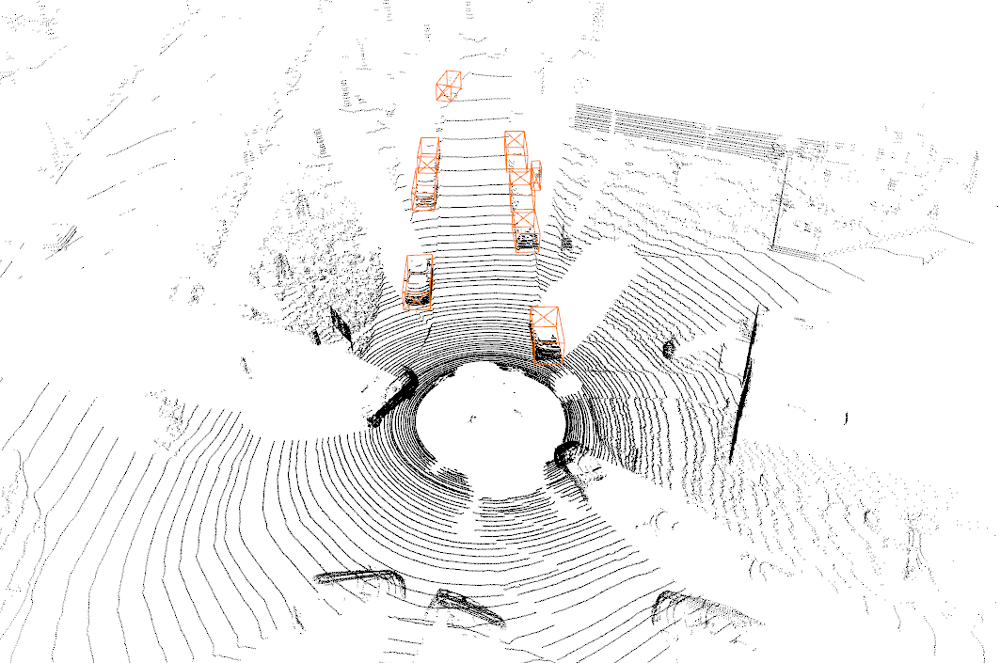
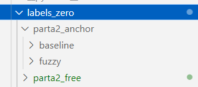
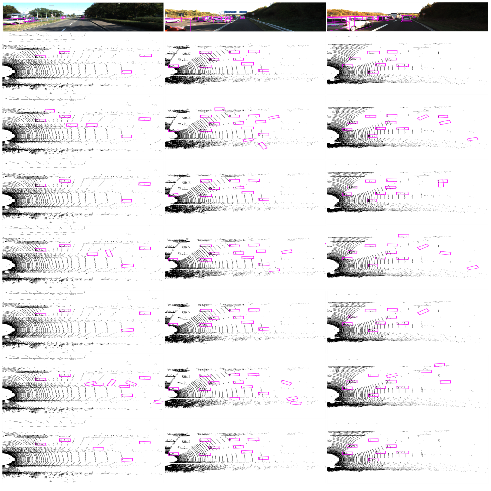
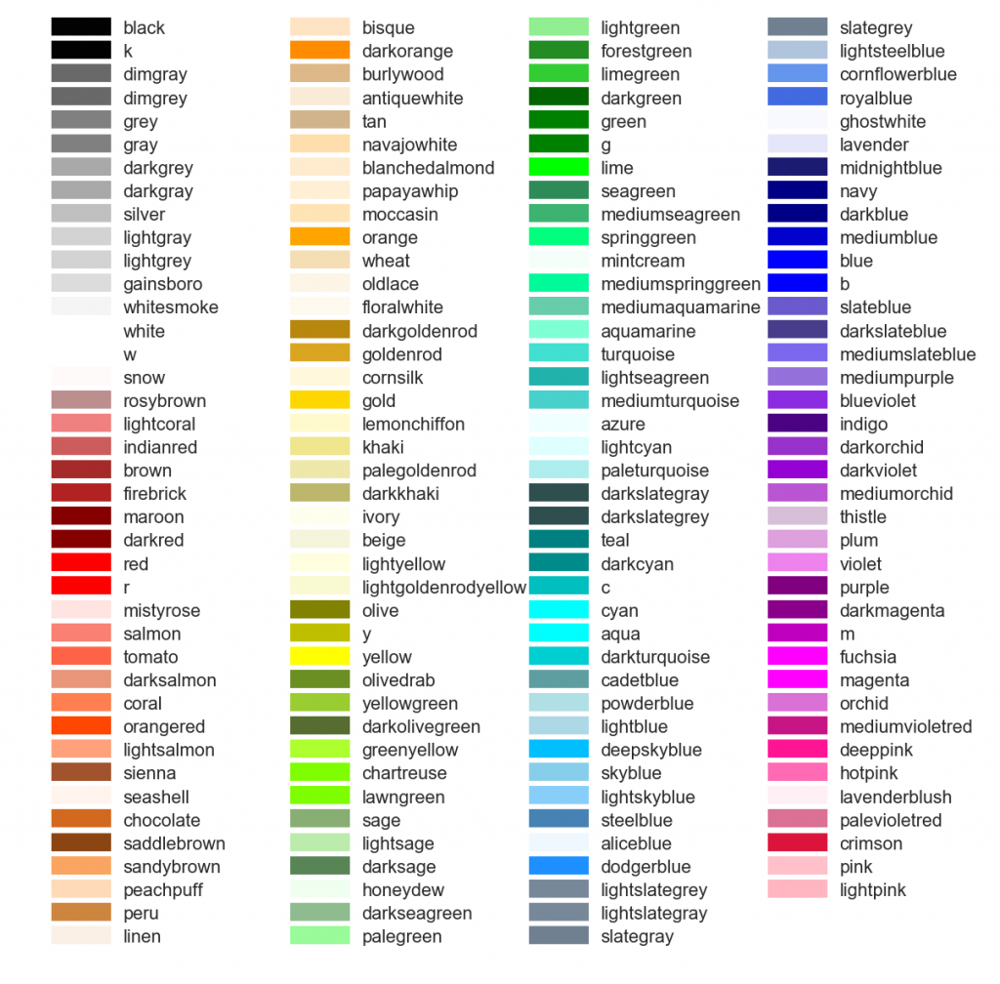
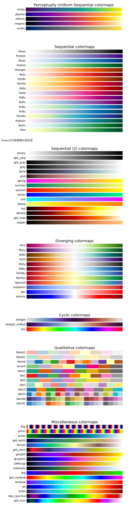

该项目主要是为对比Fuzzy-NMS的效果，以及结果呈现
## 3D_py
```
kitti：kitti数据集，这里保存了一个作为举例
kitti_Dataset.py：绘制3D视图所需的函数库
draw_3d.py：绘制3D视图，有详细注释
*.json：视角配置
```


## BEV_img_ipynb
```
kitti_util、plot_util：函数库
draw_img：绘制图像（3D box）
draw_point：绘制点云（bev）
draw_img_point:同时绘制图像（3D box）与点云（bev）
compare：绘制对比结果，用来对比查找pointpillars、second、pv_rcnn、parta2_anchor、parta2_free预测结果
save_result：保存查找到的对比结果，将结果保存到result
labels_zero：用来储存各个模型的baseline和+Fuzzy-NMS的结果（000001.txt、000003.txt....）
```
save_result文件结构\




## Matplotlib颜色对照表


## matplotlib.cm色表
